# Explore Vilnius

[View Deployed Site Here] (<https://lukasbak.github.io/P1-Explore-Vilnius/index.html>)

Explore Vilnius is website about is a site that tries to encourage people to visit capital of Lithuania Vilnius. It is targeted towards people who might be interested to visit eastern european countries. It's main purpose is to showcase some traditional celebrations which people could partake in.

![Mockup] (documentation/support-images/am-i-responsive.png)

## User experience

Goals of the website:

1. Attract people to visit Vilnius.
2. Expose tourists to Lithuanian culture.
3. Get people signed up for new and ongoing events and celebrations

### Features

#### Navigation Bar

- Navigation bar has been designed with siplicity in mind. It has 3 links which are: Newsletter, Attractions and Logo which acts as home page.
- Navigation buttons have hover effect on them whenever they are hovered over they light up in different colour.

![Navbar] (documentation/support-images/nav-bar.png)

#### Footer

- Footer includes icons for different social media sites, these are in all 3 pages.

![Footer] (documentation/support-images/footer.png)

#### Hero image

- Hero image shows panorama picture of Vilnius at night. It also has an call to action to explore Vilnius and what it has to offer.

![Hero] (documentation/support-images/panorama-of-night-vilnius-webp)

#### Explore section

- Explore section gives suggestions for things what to do in Vilnius.

#### Celebrations section

- This section is about the current and upcomming celebrations within Vilnius.
- Two of these national customs that has been around for long time and might be interesting for tourists to partake in.
- Light festival is an international light festival which could be attractive to those who have been part of in other countries.

#### Sign up section

- Newsletter is used to sign people for new happenings within the City.
- In order to sign up people need to use their first name, second name and their email.
- It is usefull for user to learn more about current happenings.

### Possible future features and additions to website

- Useful adittion to the website would be contact form. It could be used both for people interested in the events and event organisers.
- Aditional events and customary celebrations would be a good edition to attract more people in to the website.
- Adding a video to showcase activies within Vilnius would be a useful edition.

### Testing

- I have tested that this webpage works on different browsers: Google Chrome, Edge, Opera and Firefox

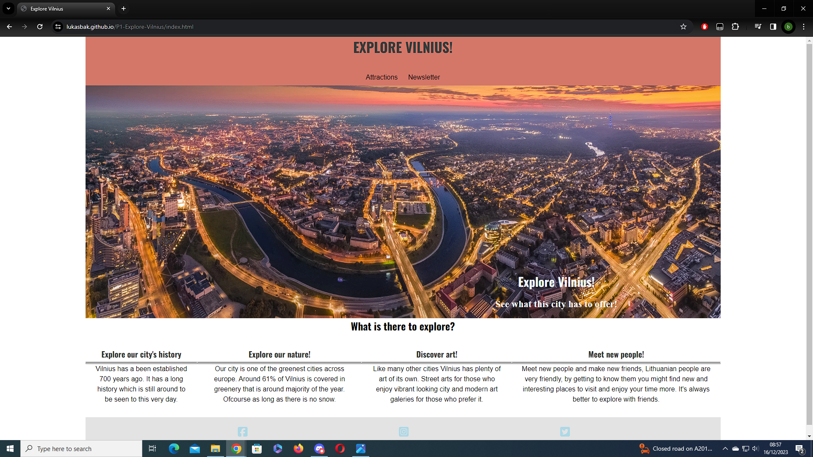
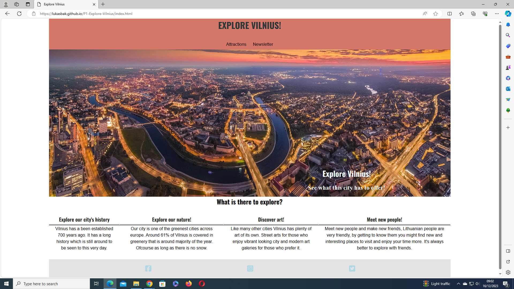
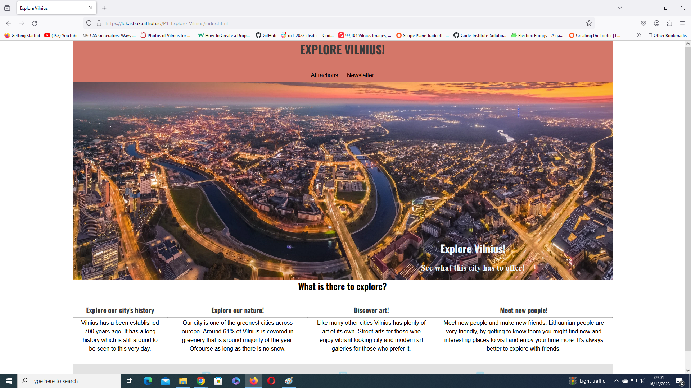
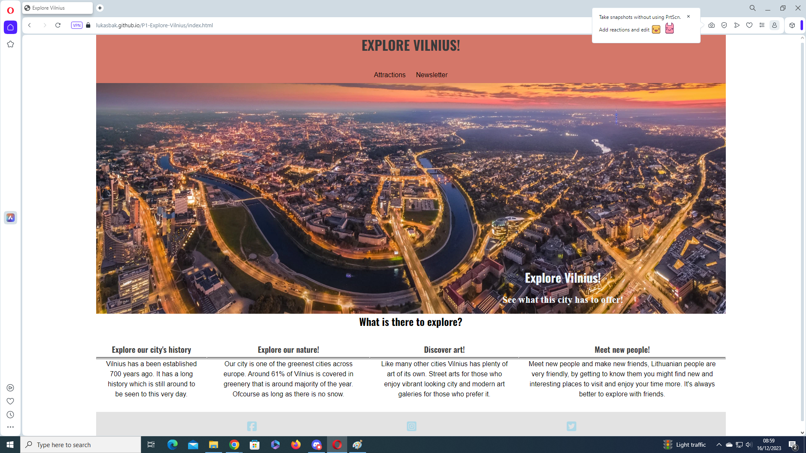

- I have tested my website on lighthouse for both phone and dekstop.

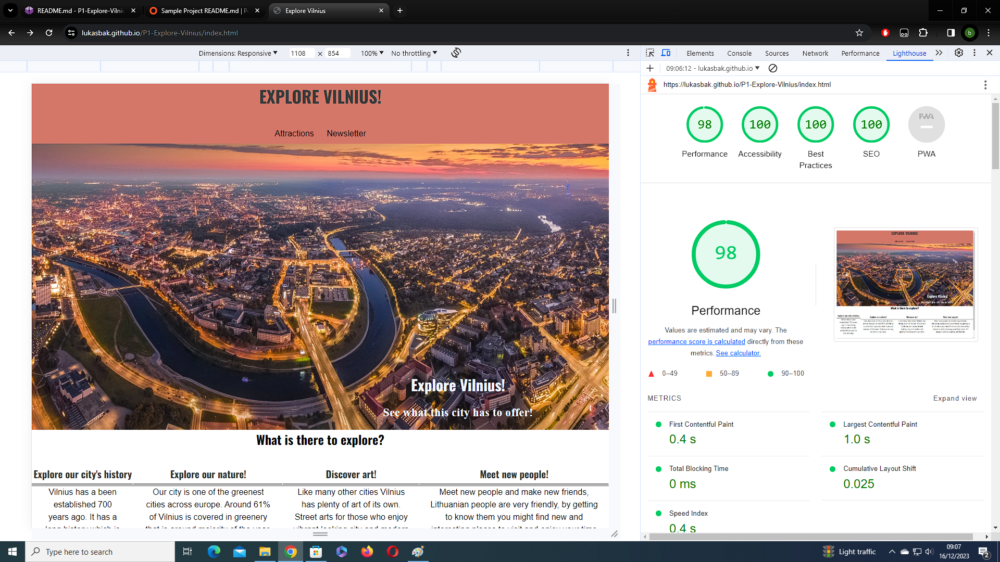
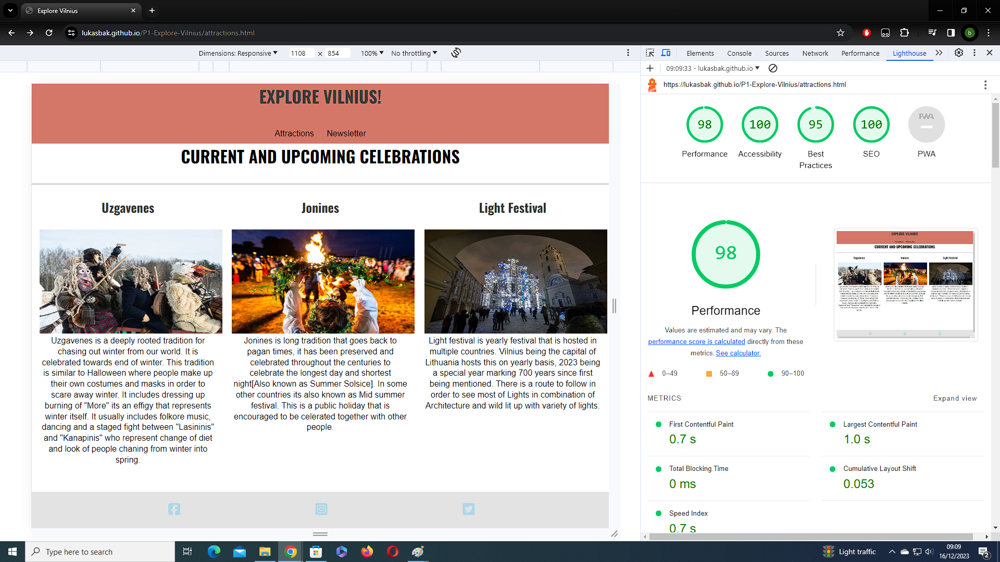
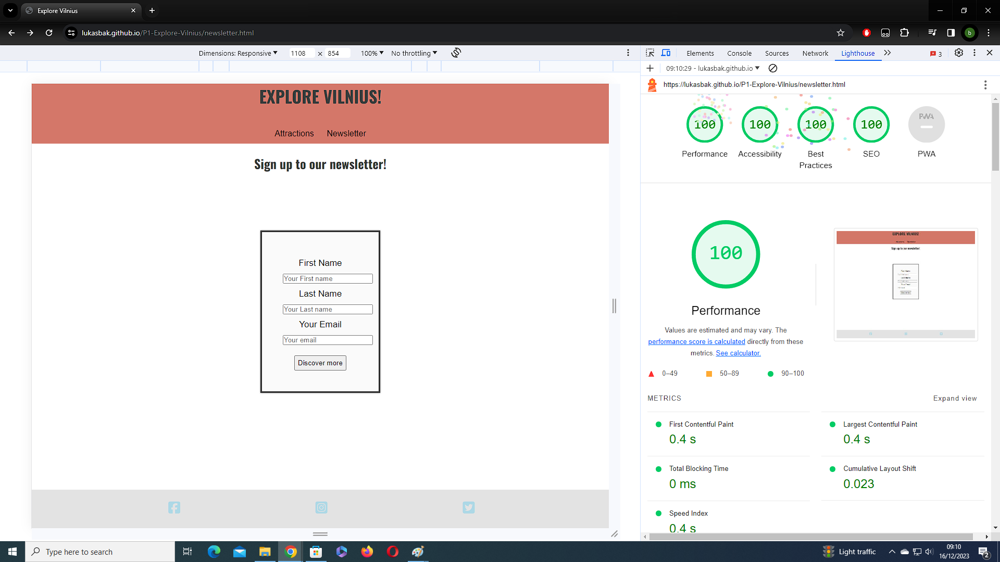

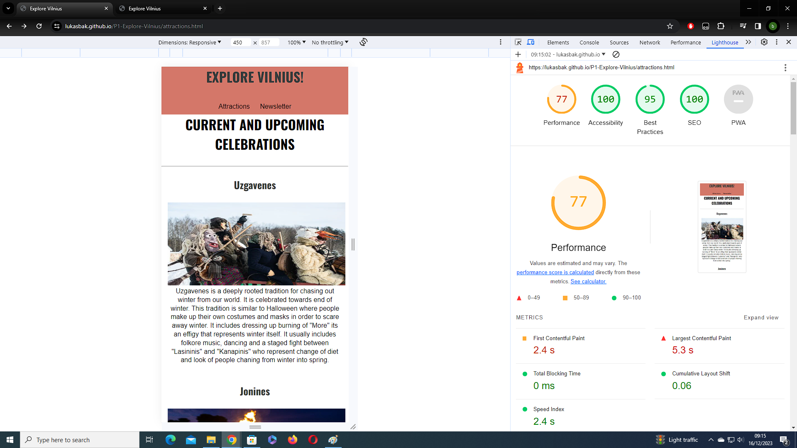
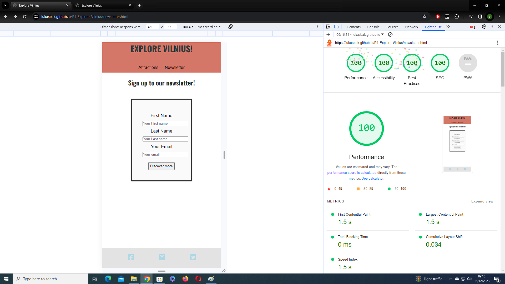

- I have valitated my code using W3C html and css validators

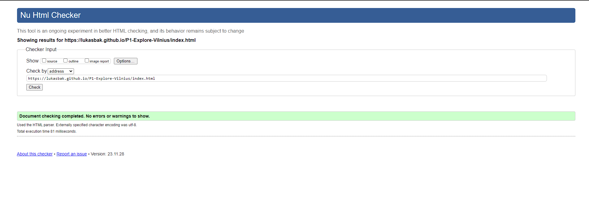
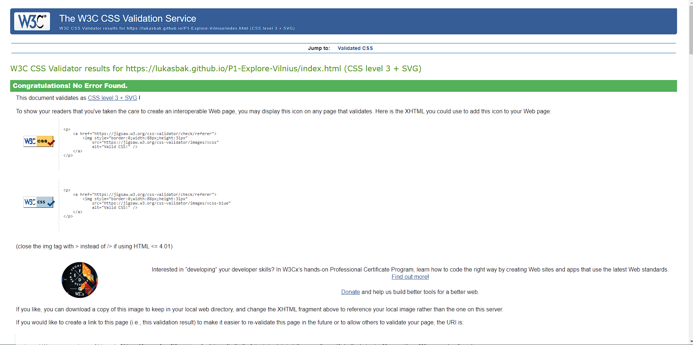

- I have tested Newsletter sign up with was successful.

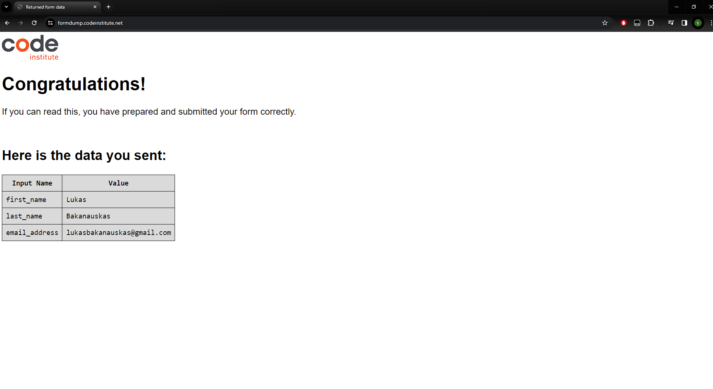

### Deployment

- This site has been deployed to Github pages.
- In the Github repository, go to the Settings tab.
- On the left side of website look for Pages.
- Under build and deployment, click on Deploy and select Deploy From branch, click save.
- Once the main branch has been selected and saved, the page will be automatically refreshed with a ribbon display to indicate the successful deployment.
- Live link can be found here: [Explore Vilnius](https://lukasbak.github.io/P1-Explore-Vilnius/index.html)

### Bugs

- Currently there has benn no bugs found.

### Credits

#### Content

- Code used for social media links was taken from CI love running project.
- Social media icons has been taken from Fontawesome
- Google Fonts has been used for fonts within website: 'Oswald' and sans serif

- Hero image has been taken from Go Vilnius by Gabriel Khiterer.
- Jonines image has been taken from Lrt website photo taken by D. Rimeika.
- Uzgavenes image has been taken from Lrt website photo taken by E. Ovčarenko.
- Light festival image has been taken from luciassociation photo taken by Saulius Ziura.

- Big thank you for my mentor for helping me out with the project with the limited time we had.
- Also big thanks to CI Tutors who helped me troubleshooting in some areas of web development.

- Final words: This project has been a big learning experience sadly I didn't have enough time to implement some other ideas that I had. I had came up with these ideas too late to impelement some of them has been added as future features. I wil make the next project stand out more.
